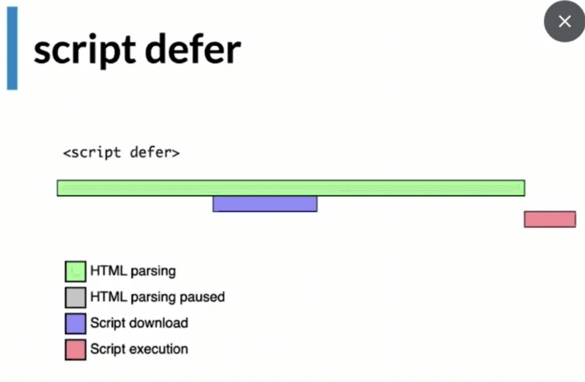
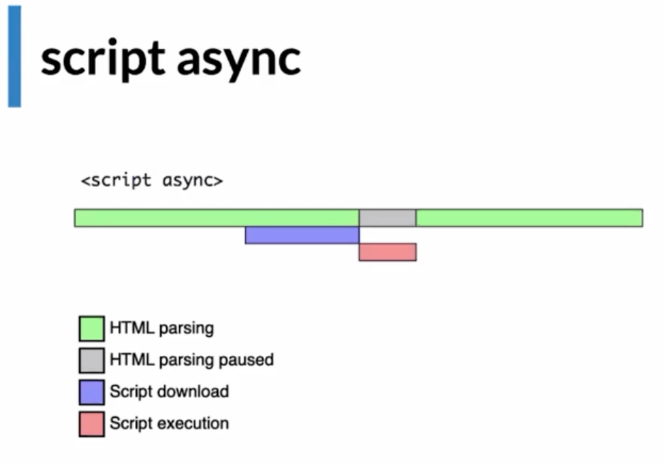

# Critical Rendering Path (CRP)

## Etapas

1. Object Model (DOM)

En esta etapa se crea el DOM, el cual es un árbol de nodos que representan los elementos de la página web.

Este se crea de arriba hacia abajo, de izquierda a derecha.

También en esta etapa se crea el CSSOM, el cual es un árbol de nodos que representan los estilos de la página web.

2. Render Tree

En esta etapa se crea el Render Tree, el cual es un árbol de nodos que junta el DOM y el CSSOM. 

3. Layout y Paint

En esta etapa se crea el Layout, el cual se calcula el tamaño y la posición de cada elemento de la página web según el viewport.

También en esta etapa se crea el Paint (Esta es la etapa más costosa), el cual es un árbol de nodos que representa los píxeles de la página web.

## Network waterfall

1. Por defecto


2. Con el atributo `defer`



3. Con el atributo `async`



## Priorización de recursos

Podemos priorizar la carga de CSS con el atributo `media`. (Esta técnica puede ser de doble filo porque cada vez que se agrega un media query se agrega un request al servidor)

1. Antes

```css
/* styles.css */
@media (min-width: 600px) {
  .header {
    font-size: 2rem;
  }
}
```

2. Después

```css
/* desktop.css */
.header {
  font-size: 2rem;
}
```

```html
<link rel="stylesheet" href="desktop.css" media="(min-width: 600px)">
```

## Carga de recursos

1. Preload (recursos). Recursos que se descargan junto con el HTML.

2. Prefetch (recursos). Recursos que se descargan para un uso futuro.

3. Preconnect (dominios). Conexión anticipada a recursos de servidores remotos.

4. DNS-prefetch (dominios). Resolución anticipada de nombres de dominio.

```html
<link rel="preconnect" href="https://fonts.gstatic.com/" crossorigin />
<link rel="dns-prefetch" href="https://fonts.gstatic.com/" />
<link rel="preconnect" href="https://kitsu.io/" crossorigin />
<link rel="dns-prefetch" href="https://kitsu.io/" />
```